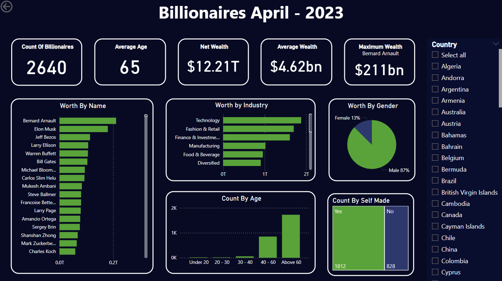

# Billionaires Statistics Analysis

## Overview
This project analyzes the **Billionaires Statistics Dataset**, which contains detailed information on the world's billionaires. The dataset includes data about their businesses, industries, and personal details, providing valuable insights into wealth distribution, business sectors, and demographics of billionaires worldwide.

The analysis uses **MySQL** for data structuring, cleaning, and exploration, along with **Power BI** for data visualization and dashboard creation.

**Dataset Date**: April 2023

## Dataset
- **Source**: [Billionaires Statistics Dataset - Kaggle](https://www.kaggle.com/datasets/nelgiriyewithana/billionaires-statistics-dataset)
- **Description**: This dataset contains statistics on the world's billionaires, including information about their businesses, industries, and personal details. It provides insights into wealth distribution, business sectors, and demographics of billionaires worldwide.
- **Files**:
  - `data/raw_data.csv`: Raw dataset containing the unprocessed data.
  - `data/cleaned_data.csv`: Cleaned dataset after data processing and cleaning.

## Project Structure
```
├── data/
│   ├── raw_data.csv       # Raw data from Kaggle
│   └── cleaned_data.csv   # Cleaned data after processing
├── sql/
│   ├── structuring.sql    # SQL script for structuring the data
│   ├── cleaning.sql       # SQL script for data cleaning
│   └── eda.sql            # SQL script for exploratory data analysis
├── reports/
│   ├── power_bi_dashboard.pbix     # Power BI dashboard file
│   └── dashboard_screenshot.png  # Screenshot of Power BI dashboard
├── README.md              # Project documentation
└── requirements.txt       # List of dependencies
```

## SQL Scripts
The SQL scripts are organized into three key steps:
1. **Structuring**: The `structuring.sql` script is used to prepare the database, creating tables and defining relationships between different columns.
2. **Cleaning**: The `cleaning.sql` script handles missing values, duplicates, and irrelevant data to create a clean dataset for analysis.
3. **EDA**: The `eda.sql` script performs exploratory data analysis, including generating key statistics and visualizing trends in the data.

## Power BI Dashboard
A Power BI dashboard was created to visualize the key insights derived from the dataset. The dashboard provides interactive elements that allow users to explore various trends and relationships within the data, such as distribution by industry, wealth, and demographic information.

### Screenshot of the Dashboard:


## Future Improvements
- **Connect the Power BI dashboard to a data source**: Enabling the dashboard to be refreshed and updated automatically as new data becomes available would enhance its functionality and ensure that insights remain up to date.

## Requirements
To run the SQL scripts and Power BI file, you will need the following:
- **MySQL**: For running SQL scripts and managing the database.
- **Power BI Desktop**: For viewing and interacting with the dashboard.
